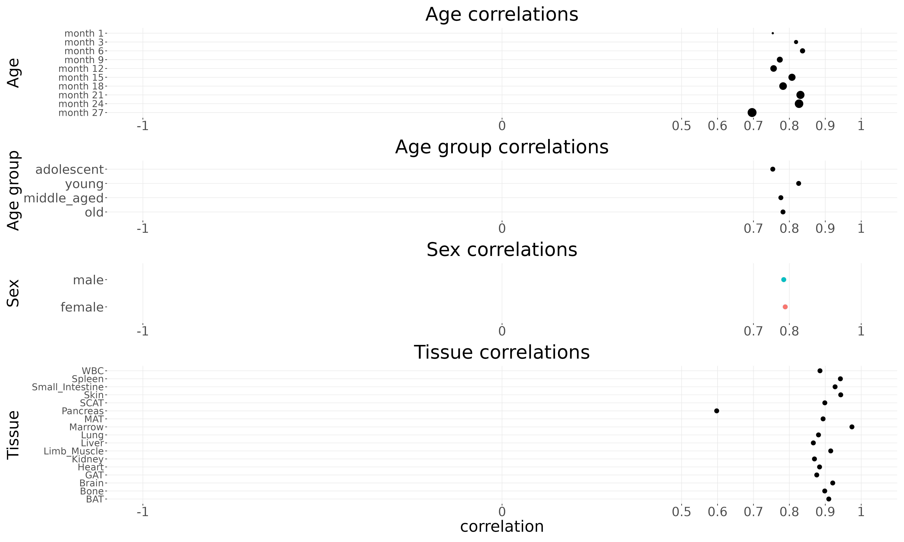
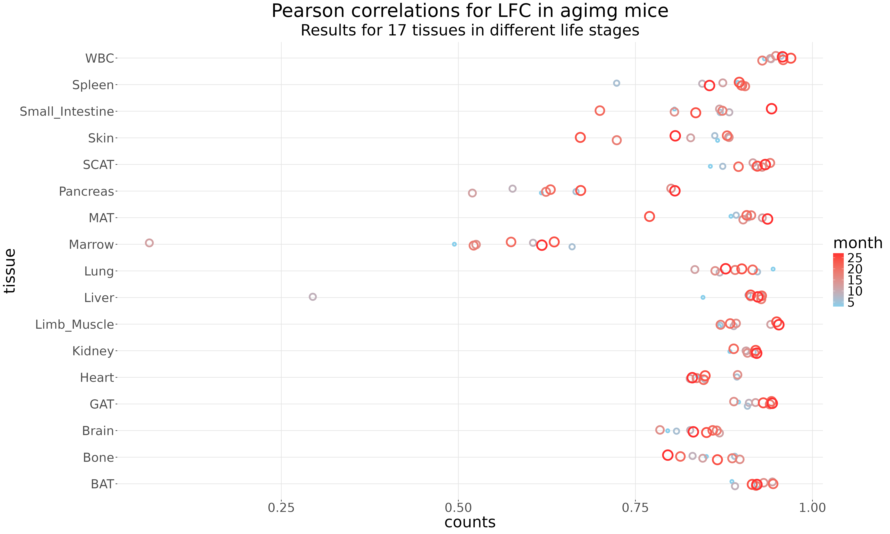
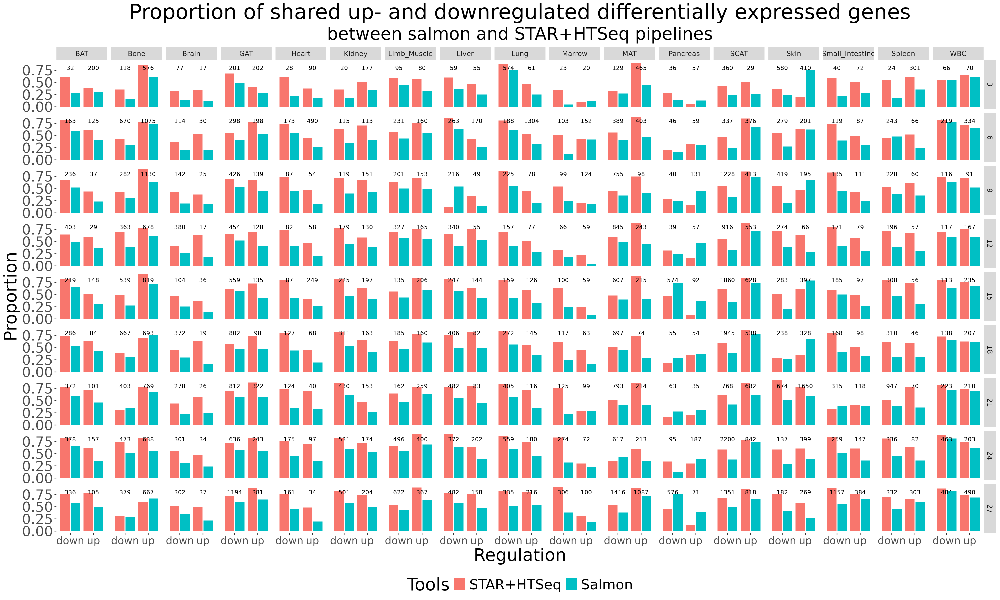

# Reproducibility

## Technical details
Analysis done on the R version 4.4.3.
Packages versions:
- rlang_1.1.6
- IOBR_0.99.0
- forcats_1.0.0 
- stringr_1.5.1
- purrr_1.0.2
- readr_2.1.5 
- tidyr_1.3.1
- tidyverse_2.0.0        
- patchwork_1.3.0        
- gplot2_3.5.1   
- dplyr_1.1.4
- tibble_3.2.1
- org.Mm.eg.db_3.20.0
- AnnotationDbi_1.68.0  
- clusterProfiler_4.14.6
- edgeR_4.4.2

## Results
The Pearson correlation between two pipelines raw counts (without any dividing) was 0.7854.

Table 1. Correlations by age (months)
| Age in months | Correlations |
|:-------------:|:------------:|
|    month 1    |   0.7537956  |
|    month 3    |   0.8186266  |
|    month 6    |   0.8366673  |
|    month 9    |   0.7733829  |
|    month 12   |   0.7560432  |
|    month 15   |   0.8072453  |
|    month 18   |   0.7824630  |
|    month 21   |   0.8308305  |
|    month 24   |   0.8269118  |
|    month 27   |   0.6961750  |

Table 2. Correlation by tissue
|      Tissue     | Correlation |
|:---------------:|:-----------:|
|       BAT       |    0.910    |
|       Bone      |    0.898    |
|      Brain      |    0.921    |
|       GAT       |    0.876    |
|      Heart      |    0.884    |
|      Kidney     |    0.870    |
|   Limb_Muscle   |    0.915    |
|      Liver      |    0.867    |
|       Lung      |    0.881    |
|       MAT       |    0.894    |
|      Marrow     |    0.974    |
|     Pancreas    |    0.598    |
|       SCAT      |    0.899    |
|       Skin      |    0.943    |
| Small_Intestine |    0.927    |
|      Spleen     |    0.942    |
|       WBC       |    0.885    |

Table 3. Correlation by sex
|   Sex  | Correlation |
|:------:|:-----------:|
| Female |  0.7884576  |
|  Male  |  0.7843201  |

The results of all these (and some other) analysis summarised at figure 1.

The results of age-tissue correlations between log-fold-change (comparing to the 1-month adolescent mice) are at the figure 2.

The results of age-tissue top- and downregulated genes (with p < 0.05 and lfc > 1) presented at the figure 3.

